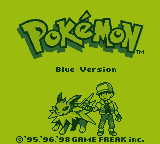

# Elmboy 

A Nintendo™ Game Boy™ Emulator written in Elm. 

[You can try it out here](https://malax.github.io/elmboy), it works best in Google Chrome. The page also provides you with links to legal homebrew ROMs you can use to test Elmboy.

**Some games are playable, but the emulator is not yet very accurate. Expect bugs and non-working games.**

## Why Elm?
You might think that Elm is a weird technology choice for writing an Emulator, and rightfully so. Emulators are highly stateful programs and their state changes a lot and very fast. With Elm being a purely-functional language everything has to be immutable and state must to be passed around the program. Additionally, running in the browser has its own set of issues, especially in the performance department.

So why Elm then? I wanted to start a non-trivial side-project in Elm. At that point it was not even decided what it would be, but it ended up being a Game Boy emulator. I wanted to push me and Elm to the limits, and this project has definitely done that 😄.

It will never be as performant or accurate as other Game Boy emulators out there that are written in lower level languages, but this is not what this project strives to be. If you are looking for a serious emulator, I can recommend [SameBoy](https://github.com/LIJI32/SameBoy) or [Gambatte](https://github.com/sinamas/gambatte).

## Performance
In its current state, some games, especially earlier ones, run at their native speed of ~60 frames per second on Chrome. This is on my MacBook Pro (Mid 2015, 2.5 GHz Intel Core i7, 16 GB RAM), running Chrome 69.0.3497.100. Performance in other browsers is worse, Chrome seems to have a better performing JIT compiler for this project. I want to further improve performance in the future, also on other browers.

## Project Goals
This is mainly for my own entertainment, education and challenge. It's a non-trivial problem to solve, I love retro games and have a some sort of emotional 
connection  to the Game Boy. There are hundreds of Game Boy emulators out there, but there wasn't one for Elm yet. And as I love Elm very much, this was the perfect side-project for me. Also, I think it's pretty cool!

One goal I have is staying true to Elm. As little JavaScript as possible and nice functional code all around. Sadly, I had to compromise on the *nice*
functional code in some cases due to performance issues, but I want to re-introduce some abstractions and nicer types again as the core performance issues are ironed out and there might be some breathing room to put them back in.

## Non-Goals
- Achieving a very high degree of emulation accuracy
- Becoming a "serious" emulator that can used by Homebrew developers and/or speed runners
- Debugging capabilities
- Game Boy Color support

## Building
Run `npm install` to produce an optimised build in the `dist` folder. For development, run `npm start` to spawn a HMR development server.
